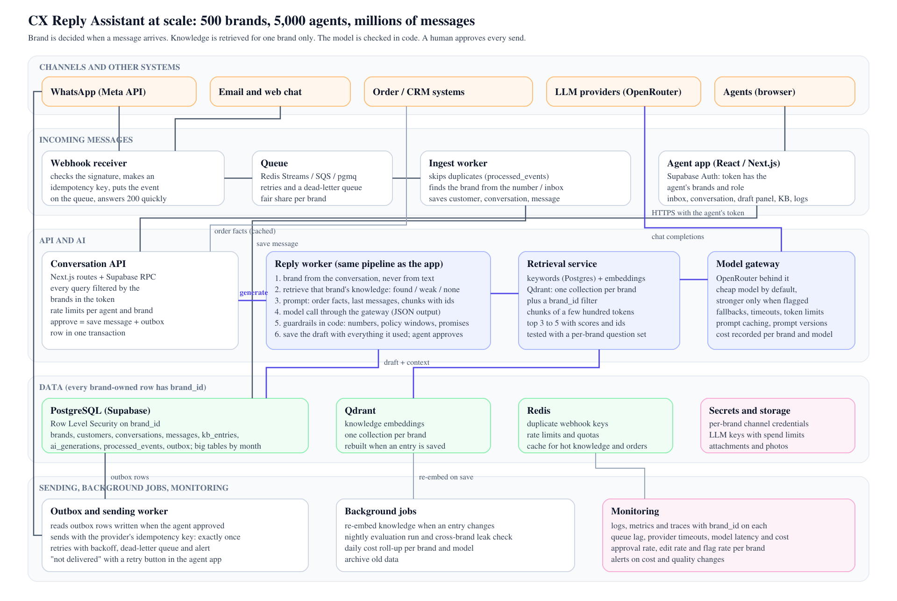

<p align="left"></p>

# CX Reply Assistant

A small web app that helps a customer support agent reply to a customer with the help of AI. The agent opens a conversation, clicks **Generate AI reply**, and gets a draft that is based only on that brand's policies. The agent can edit it, regenerate it, approve it, or just write their own reply. Nothing is sent to the customer without the agent approving it.

I built this for the Datastraw Tech Lead assessment. Part 1 (the app) is this repo. Part 2 (system design) and Part 3 (AI costs) are in the [`docs`](docs/) folder.

**Live demo:** https://cx-reply-assistant-gold.vercel.app

## What it does

- **Inbox and conversation view.** Customer name, brand, order details (items, total, when it was delivered), the message history and the latest customer message.
- **Customer / Agent toggle.** You can type a message as the customer, then switch back to the agent side and generate a reply to it. This makes it possible to test the whole AI loop end to end instead of only looking at seeded data.
- **Knowledge base per brand.** Two demo brands, Glow & Co. (skincare) and Peak Fuel (supplements), each with return, refund, shipping and cancellation policies. The policies are different on purpose (for example a 30-day refund window vs a 7-day one) so it is easy to check that one brand's rules are never used for the other. Entries can be added, edited and deleted from the UI.
- **Generate AI reply.** The app finds the brand, retrieves the relevant policies for that brand only, sends them to the model together with the order facts and the conversation, and shows the draft next to the knowledge that was used.
- **Edit, regenerate (optionally with an instruction like "shorter"), approve, or reply manually.**
- **Guardrails.** The model is told to only use the policies it was given, and the app runs its own checks on the draft afterwards (details below). If nothing relevant is in the knowledge base, the draft becomes a "let me check and get back to you" message and the agent sees a clear warning.
- **Logging.** Every generation is stored with the customer message, the retrieved context, the AI response, the agent's edits, the final response and timestamps. The **AI logs** page shows all of it.

## Tech stack

- Next.js 15 (React 19, TypeScript) with API routes for the backend
- PostgreSQL on Supabase, accessed with `postgres.js`. When no database is configured the app uses an in-memory store with the demo data, so it runs locally with zero setup.
- OpenRouter for the LLM (default model `openai/gpt-4o-mini`). When no API key is set, a mock model is used so the UI still works.
- Tailwind CSS v4, lucide-react icons
- Vitest for tests
- Vercel for hosting

I went with Next.js and Postgres because they are close to the stack in the assessment (React, Supabase, OpenRouter) and because one repo can hold both the UI and the API.

## Running it locally

You need Node 20.12 or newer.

```bash
npm install
npm run dev
```

Open http://localhost:3000. The badges in the header show `memory store` and `mock model` until you add real credentials.

To use a real model, copy `.env.example` to `.env.local` and set `OPENROUTER_API_KEY`. To keep data in a real database, set `DATABASE_URL` and run the migration and seed:

```bash
npm run db:setup
```

### Environment variables

| Variable | What it is |
| --- | --- |
| `OPENROUTER_API_KEY` | Key from https://openrouter.ai/keys. Without it the mock model is used. |
| `OPENROUTER_MODEL` | Model id, default `openai/gpt-4o-mini`. If the OpenRouter account has no credit, paid models are refused, so use a free one such as `nvidia/nemotron-3-super-120b-a12b:free` (free models have a daily request cap). |
| `OPENROUTER_FALLBACK_MODELS` | Comma separated models to try if the first one fails (at most two), default `google/gemini-2.5-flash-lite`. |
| `DATABASE_URL` | Postgres connection string. For Supabase use the Transaction pooler string (port 6543). Without it the in-memory store is used. |
| `NEXT_PUBLIC_APP_URL` | The app URL, sent to OpenRouter as the referer. |
| `GENERATE_RATE_LIMIT_PER_MINUTE` | How many AI generations one IP can trigger per minute, default 10. |

### Scripts

| Command | What it does |
| --- | --- |
| `npm run dev` | Start the dev server |
| `npm run build` and `npm start` | Production build and start |
| `npm test` | Run all tests |
| `npm run typecheck` and `npm run lint` | TypeScript and ESLint checks |
| `npm run db:migrate` | Apply the SQL files in `supabase/migrations` |
| `npm run db:seed` | Insert or refresh the demo data (`-- --reset` wipes everything first) |
| `npm run db:setup` | Migrate and then seed |

## How the AI reply works

Everything happens in one function, `generateReply` in [`src/lib/ai/generateReply.ts`](src/lib/ai/generateReply.ts):

1. **Find the brand.** The brand is stored on the conversation (in real life it would come from which WhatsApp number or inbox received the message). It is never guessed from the message text, so a customer cannot "talk their way" into another brand's policies.
2. **Retrieve knowledge.** Load the knowledge entries for that brand only and rank them against the customer's message. The top 3 are used. If the best match is too weak, the status becomes `none` and the model is told that there is no relevant knowledge.
3. **Build the prompt.** A system prompt with the brand's tone and the rules (only use the given policies, never invent windows or fees, do not promise things outside the policy, say you will check if the knowledge does not cover it). The user prompt contains the order facts (including "delivered 20 days ago", calculated in code so the model does not have to do date maths), the last few messages, and the retrieved entries with their ids.
4. **Call the model.** OpenRouter in JSON mode, 25 second timeout, one retry on temporary errors, and a fallback model list. If the JSON comes back broken the app asks once more; if the provider fails completely, the agent gets a safe holding reply with a red flag instead of an error page.
5. **Run the guardrails** (below) and save everything to the `ai_generations` table.

The model has to answer in a fixed JSON shape: the reply, its confidence, whether it thinks the reply is grounded, which entries it used, what information is missing, and whether a human should review it.

### Guardrails

The model's own self-assessment is useful but not enough, so these checks run in code and are shown to the agent as flags on the draft:

| Flag | When |
| --- | --- |
| `NO_KNOWLEDGE` (critical) | Nothing relevant was found. The draft is a holding reply. |
| `MODEL_OVERRIDDEN` (critical) | Nothing was found but the model still claimed to be grounded, so its text is replaced with the holding reply. |
| `UNGROUNDED` (critical) | The model itself says parts of the reply are not supported by the policies. |
| `POLICY_WINDOW_EXCEEDED` (warning, or critical) | A retrieved policy says "within N days of delivery", the order was delivered later than that, and the reply talks about a refund, return or replacement. It becomes critical if the reply also promises the outcome ("we will process your full refund"). |
| `UNSUPPORTED_NUMBERS` (warning) | A number in the reply (days, amounts, hours) does not appear in the policies, the order facts or the customer's message. |
| `OVERPROMISE_RISK` (warning) | The reply commits to something while confidence is not high. |
| `WEAK_RETRIEVAL`, `LOW_CONFIDENCE`, `NEEDS_REVIEW`, `MISSING_INFO` | Softer signals from retrieval and from the model's self-assessment. |
| `MALFORMED_OUTPUT`, `LLM_UNAVAILABLE` (critical) | The model did not return usable JSON, or the provider was down. |

Two examples from the seed data:

- Rahul (Peak Fuel) asks for a refund 20 days after delivery. The policy says 7 days. The prompt contains "delivered 20 days ago" and the refund policy, so a good draft explains the window without promising anything. If the model promises anyway, the flag turns critical and the panel says "Do not send as is".
- Karan (Peak Fuel) asks about gift wrapping. There is no such policy, so retrieval returns nothing, the draft is a holding reply, and the agent sees `NO_KNOWLEDGE`. Adding a gift wrapping entry on the Knowledge page and regenerating fixes it, without any code change.

### Why keyword retrieval and not embeddings

Each brand has a handful of short policies, so I used a simple keyword search (BM25 scoring over the title, tags and content, plus a small synonym list so "broken" matches "damaged" and "didn't like the taste" matches "change of mind"). It is easy to understand and debug: the agent can see exactly which words matched and the brand team can steer it by editing tags in the UI. It costs nothing and there is nothing to re-index when a policy changes.

The downside is that it can miss paraphrases and can match on the wrong meaning of a word. The retrieval function returns the ranked entries plus a `found / weak / none` status behind one interface, so switching to embeddings (for example Qdrant with one collection per brand) later would be a change in one file. I would add a small test set of question-to-entry pairs before doing that.

### Keeping brands separate

- Every row that belongs to a brand has a `brand_id`.
- The store only has a "list knowledge for this brand" method; there is no way to list all knowledge at once.
- The brand comes from the conversation record, not from the text.
- Tests check that a Peak Fuel customer never gets Glow & Co. text, even when using Glow-specific words, and the other way around.
- In production I would add Supabase Auth and Row Level Security on `brand_id` so the database enforces it as well.

## Data

The schema is in [`supabase/migrations/0001_init.sql`](supabase/migrations/0001_init.sql):

| Table | What it holds |
| --- | --- |
| `brands` | Name, description, the tone used in the prompt |
| `kb_entries` | Policies per brand: category, title, content, tags |
| `customers`, `orders` | Mock CRM data; orders have items and ordered / shipped / delivered dates |
| `conversations` | Linked to a brand, a customer, an order and a channel |
| `messages` | The thread; agent messages record whether they were manual, AI approved or AI edited |
| `ai_generations` | The audit log: customer message, retrieved context, model and tokens, AI response, flags, agent edits, final response, status and timestamps |

Ids are generated in the app (for example `gen_…`), so the in-memory and Postgres stores behave the same way and the tests can run against both.

## API

| Method and path | Purpose |
| --- | --- |
| `GET /api/health` | Which store and model are active |
| `GET /api/brands` | List brands |
| `GET` / `POST /api/brands/:brandId/kb` | List or add knowledge entries for a brand |
| `PUT` / `DELETE /api/kb/:entryId` | Update or delete an entry |
| `GET /api/conversations` | Inbox |
| `GET /api/conversations/:id` | Conversation with the open draft and recent generations |
| `POST /api/conversations/:id/messages` | Send a message as the customer or the agent |
| `POST /api/conversations/:id/generate` | Run the AI pipeline (rate limited) |
| `GET /api/generations` | Audit log |
| `PATCH /api/generations/:id` | Approve (with the final text) or discard a draft |

Inputs are validated with zod and errors come back as `{ "error": "..." }`.

## Tests

```bash
npm test
```

- Retrieval: stemming, each seeded question finds the right policy, uncovered questions return `none`, brand isolation.
- Guardrails: number checks, policy window logic, the no-knowledge path, promise detection.
- Pipeline: the whole flow with a scripted fake model, including broken JSON, provider failure and the approve / discard state changes.
- Postgres store: the real adapter against an embedded Postgres (PGlite), so the SQL and transactions are tested without Docker.
- OpenRouter client: request shape, retries and error handling against a fake `fetch`.

## Deploying to Vercel

1. **Database.** Create a Supabase project. In Project Settings, Database, copy the Transaction pooler connection string (port 6543). Run the migration and seed from your machine:
   ```bash
   DATABASE_URL="postgresql://..." npm run db:setup
   ```
2. **LLM.** Create an OpenRouter key and set a monthly spend limit on it.
3. **Vercel.** Import the GitHub repo, add the environment variables from the table above (at least `OPENROUTER_API_KEY`, `DATABASE_URL` and `NEXT_PUBLIC_APP_URL`), and deploy.
4. Check `https://your-app.vercel.app/api/health`. It should say `"store": "postgres"` and show the model name, and the header badges turn green.

The generate route sets `maxDuration = 60` so a slow model call is not cut off by the default function timeout.

## Project structure

```
src/
  app/                 pages (inbox, conversation, knowledge, logs) and API routes
  components/          UI components
  lib/
    ai/                generateReply (the pipeline), prompt, guardrails, OpenRouter client, output schema
    retrieval/         tokenizer, synonyms, BM25 ranking
    store/             store interface, in-memory adapter, Postgres adapter, seeding
    seed/data.ts       demo brands, policies, customers, orders, conversations
    domain/types.ts    shared types
supabase/migrations/   SQL schema
scripts/               migrate and seed
tests/                 Vitest suites
docs/                  system design (Part 2) and AI cost notes (Part 3)
```

## System design at scale (Part 2)



The short version: messages come in through webhooks and go onto a queue, a worker stores them and works out the brand from the channel they arrived on, the agent app talks to an API that always filters by the agent's brands, and a reply service does what this app's `generateReply` does today but as a background job with a model gateway in front of OpenRouter. Postgres (with row level security on `brand_id`) is the main database, Qdrant holds knowledge embeddings per brand, Redis handles caching, rate limits and duplicate webhooks, and sending goes through an outbox table so a message is never sent twice or lost. The full write-up, including what breaks first at 500 brands and how to handle duplicate webhooks, timeouts and failed sends, is in [`docs/architecture.md`](docs/architecture.md).

## AI costs (Part 3)

My answer to the "₹20k to ₹1 lakh a month" scenario is in [`docs/ai-cost-investigation.md`](docs/ai-cost-investigation.md).

## What I would improve with more time

- A proper evaluation set built from the logs (how often agents edit the AI text, which flags fire, retrieval hit rate) and a way to replay it when the prompt or model changes.
- Supabase Auth with row level security, so agents only see their brands.
- Real-time updates in the inbox instead of refreshing after each action.
- Hybrid retrieval (keywords plus embeddings) once brands have more than a handful of articles.
- Actual WhatsApp delivery through an outbox and a sending worker, as described in the design doc.

## AI tools

I used Claude (Claude Code) while building this, mainly for scaffolding, writing tests from the scenarios I described, and reviewing the guardrail logic. Everything in the repo was reviewed and tested by me, including a few things the AI got wrong that the tests caught: a retrieval false positive, a stemming gap, a test clock bug and a server component mistake.
